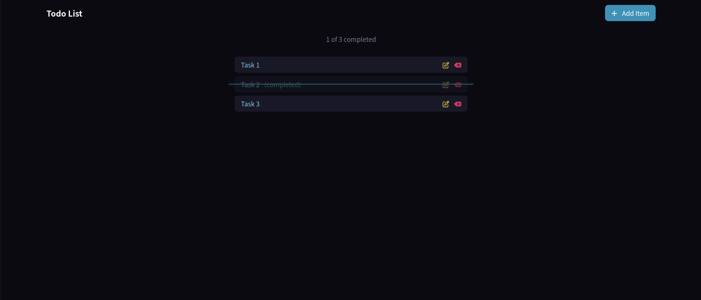
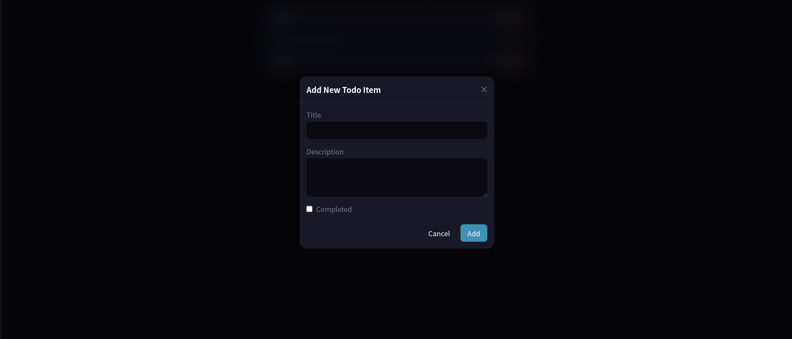
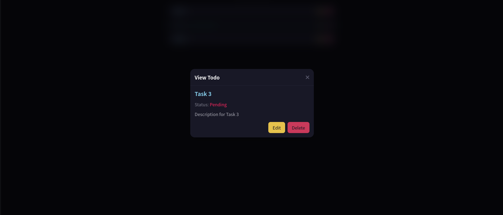
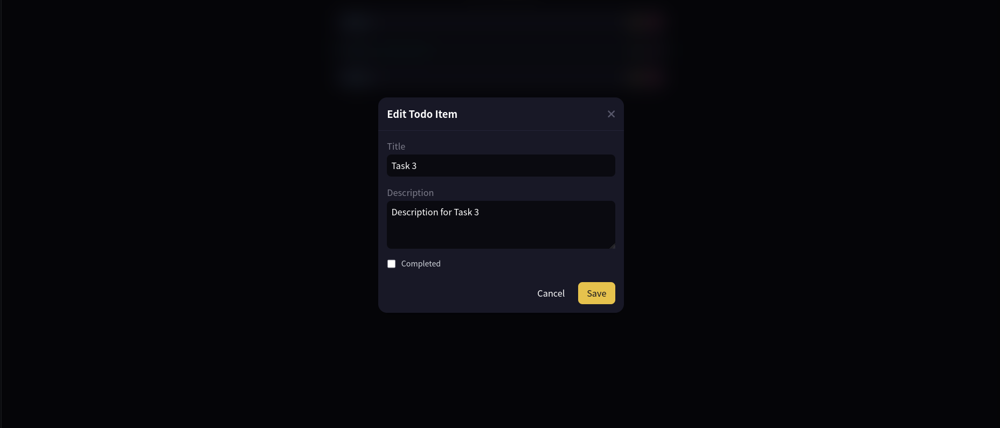
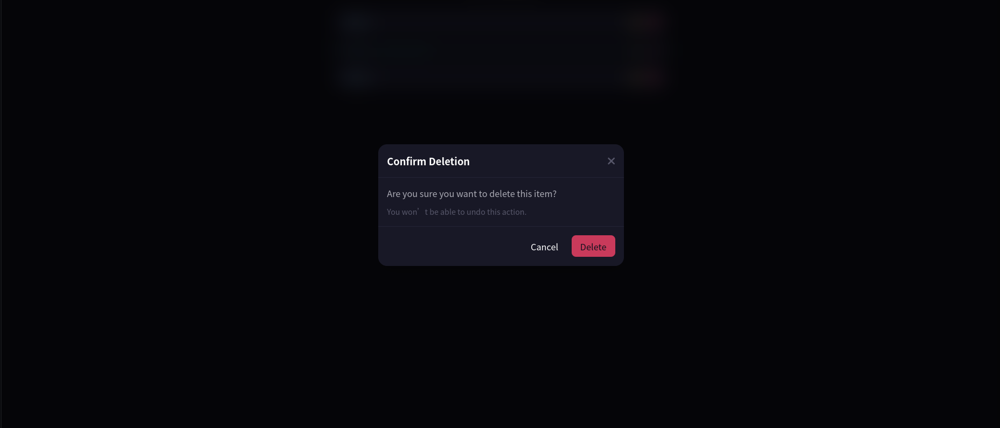

# 📝 Quarkus Server-Side Web App Example

[](https://quarkus.io/)
[](https://openjdk.org/)
[](https://htmx.org/)
[](https://tailwindcss.com/)
[](https://quarkus.io/guides/hibernate-orm-panache)
[](https://www.h2database.com/)

A modern, high-performance, full-stack server-side rendered **To-Do List Web Application** built with **Quarkus 3**, **Qute Templates**, **HTMX**, and **Tailwind CSS**. 

This application demonstrates how to build dynamic, single-page-app (SPA) like user experiences using hypermedia-driven server-side rendering without the complexity of heavy JavaScript frontend frameworks.

---

## 📸 Screenshots & UI Walkthrough

### 1. Main Dashboard & Task List
View all tasks, filter progress, and track overall completion with real-time counters.



---

### 2. Create Task Modal
Open dynamic modal dialogs rendered on-demand by the server via HTMX without full-page reloads.



---

### 3. View Task Details
Inspect individual task details in an interactive modal.



---

### 4. Edit Task Modal
Update task titles, descriptions, and completion status seamlessly.



---

### 5. Confirmation Dialog & Notifications
Delete confirmation prompt with SweetAlert2 integration and instant toast feedback.



---

## ✨ Key Features

- **⚡ Full CRUD Operations**: Create, read, update, and delete tasks with instantaneous UI updates.
- **🔄 Hypermedia-Driven (HTMX)**: AJAX swaps, modal popups, out-of-band updates, and reactive component rendering without client-side state management.
- **🎯 Type-Safe Templating (Qute)**: Compile-time checked HTML templates using Quarkus Qute with `@CheckedTemplate` and `@TemplateExtension`.
- **🎨 Modern Dark UI (Tailwind CSS 4)**: Sleek, responsive dark theme styled with Tailwind CSS v4 and Font Awesome 6 icons.
- **🛡️ CSRF Protection**: Integrated CSRF token injection into all HTMX request headers (`quarkus-rest-csrf`).
- **💾 Persistence with Hibernate ORM & Panache**: Simplified active record / entity repository patterns backed by an in-memory H2 database.
- **📦 Zero-Config Asset Bundling**: Quarkus Web Bundler packages scripts, styles, and web dependencies automatically.
- **🔔 Toast & Modal Feedback**: Integrated SweetAlert2 notifications and animated loading spinners for smooth UX.

---

## 🛠️ Technology Stack

| Component | Technology | Description |
|---|---|---|
| **Backend Framework** | [Quarkus 3.25.4](https://quarkus.io/) | Supersonic Subatomic Java Framework |
| **Language** | [Java 21](https://openjdk.org/) | Modern LTS Java |
| **Server Templating** | [Quarkus Qute](https://quarkus.io/guides/qute) | Fast, type-safe server-side templating engine |
| **Frontend Interactivity** | [HTMX 2.0.6](https://htmx.org/) | Server-driven dynamic AJAX & DOM swapping |
| **Styling** | [Tailwind CSS 4.x](https://tailwindcss.com/) & [PostCSS](https://postcss.org/) | Utility-first modern CSS framework |
| **Database & ORM** | [Hibernate ORM with Panache](https://quarkus.io/guides/hibernate-orm-panache) + [H2](https://www.h2database.com/) | In-memory relational database & persistence |
| **Icons & Alerts** | [Font Awesome 6](https://fontawesome.com/) + [SweetAlert2](https://sweetalert2.github.io/) | UI iconography and interactive feedback modals |
| **Build Tools** | [Maven](https://maven.apache.org/) & [Node.js/npm](https://nodejs.org/) | Java & frontend asset build tooling |

---

## 📁 Project Structure

```plaintext
quarkus-webapp-example/
├── screenshots/                     # Application UI screenshots
│   ├── todolist.png
│   ├── add-item.png
│   ├── view-item.png
│   ├── update-item.png
│   └── confirm-delete.png
├── src/
│   ├── main/
│   │   ├── java/com/ansbeno/
│   │   │   ├── TodoEntity.java          # Panache JPA Entity
│   │   │   ├── TodoDto.java             # Data Transfer Object
│   │   │   ├── TodoMapper.java          # Entity <-> DTO Mapper
│   │   │   ├── TodoService.java         # Business Service Interface
│   │   │   ├── TodoServiceImpl.java     # Service Implementation
│   │   │   ├── TodoListResource.java    # REST / Qute HTML Controller
│   │   │   └── ToastNotification.java   # Notification model
│   │   ├── resources/
│   │   │   ├── application.properties   # App configuration & DB settings
│   │   │   ├── import.sql               # Initial seed data
│   │   │   ├── templates/               # Qute HTML templates
│   │   │   │   ├── layouts/             # Main and modal layouts
│   │   │   │   ├── fragments/           # Reusable HTML snippets (e.g., delete modal)
│   │   │   │   └── todolist/            # Todo-specific views (index, forms, lists)
│   │   │   └── web/                     # Web Bundler frontend assets
│   │   │       ├── app/                 # JavaScript logic & custom CSS
│   │   │       └── static/              # Tailwind input styles
│   │   └── docker/                      # Dockerfiles for JVM & Native builds
├── package.json                         # Frontend dependencies & Tailwind build scripts
├── pom.xml                              # Maven project dependencies & plugins
└── README.md                            # Project documentation
```

---

## 🚀 Getting Started

### Prerequisites

- **Java JDK 21+** installed (`java -version`)
- **Node.js (v18+) & npm** (`node -v`, `npm -v`)
- **Maven** (optional, wrapper `./mvnw` is included)

---

### Step 1: Install Frontend Dependencies & Build CSS

Install node modules and compile Tailwind CSS:

```bash
# Install NPM dependencies
npm install

# Build Tailwind CSS styles
npm run tw:build
```

> **Tip:** While developing styles, run `npm run tw:watch` in a separate terminal to automatically recompile on CSS/template changes.

---

### Step 2: Run the Application in Dev Mode

Start Quarkus in live-coding development mode:

```bash
./mvnw quarkus:dev
```

Once started:
- 🌐 **Web App:** Open [http://localhost:8080/todolist](http://localhost:8080/todolist) in your browser.
- 🛠️ **Quarkus Dev UI:** Access [http://localhost:8080/q/dev/](http://localhost:8080/q/dev/) to inspect endpoints, templates, beans, and configurations.

---

## 📡 REST / HTMX Endpoints

The application exposes the following endpoints via `TodoListResource`:

| Method | Endpoint | Description | Response / Target |
|---|---|---|---|
| `GET` | `/todolist` | Render the main To-Do list dashboard | Full HTML page (`index.html`) |
| `GET` | `/todolist/item/new` | Load the modal form to create a new item | Partial HTML (`createItemFormModal.html`) |
| `POST` | `/todolist/item/new` | Submit and create a new task | Updated list snippet (`listItems.html`) |
| `GET` | `/todolist/item/{id}` | Load task details modal | Partial HTML (`viewItemModal.html`) |
| `GET` | `/todolist/item/{id}/edit` | Load the modal form to edit an existing task | Partial HTML (`editItemFormModal.html`) |
| `PATCH` | `/todolist/item/{id}/edit` | Update task details | Updated list snippet (`listItems.html`) |
| `DELETE` | `/todolist/item/{id}` | Delete a task | Updated list snippet (`listItems.html`) |

---

## 📦 Packaging & Deployment

### 1. Standard JVM Application

Package the application as a standard runnable fast-JAR:

```bash
./mvnw package
java -jar target/quarkus-app/quarkus-run.jar
```

### 2. Über-JAR Package

Create a single self-contained executable JAR:

```bash
./mvnw package -Dquarkus.package.jar.type=uber-jar
java -jar target/*-runner.jar
```

### 3. Native Executable (GraalVM / Mandrel)

Build an ultra-fast, lightweight native executable with GraalVM:

```bash
# With local GraalVM installed:
./mvnw package -Dnative

# Or using a Docker container (no local GraalVM required):
./mvnw package -Dnative -Dquarkus.native.container-build=true
```

Run the native binary:

```bash
./target/web-app-serverside-1.0.0-SNAPSHOT-runner
```

---

## 📜 Guides & References

- [Quarkus Qute Templating Guide](https://quarkus.io/guides/qute)
- [Quarkus Web Bundler](https://docs.quarkiverse.io/quarkus-web-bundler/dev/)
- [HTMX Documentation](https://htmx.org/docs/)
- [Tailwind CSS v4 Documentation](https://tailwindcss.com/docs)
- [Quarkus Hibernate ORM with Panache](https://quarkus.io/guides/hibernate-orm-panache)

